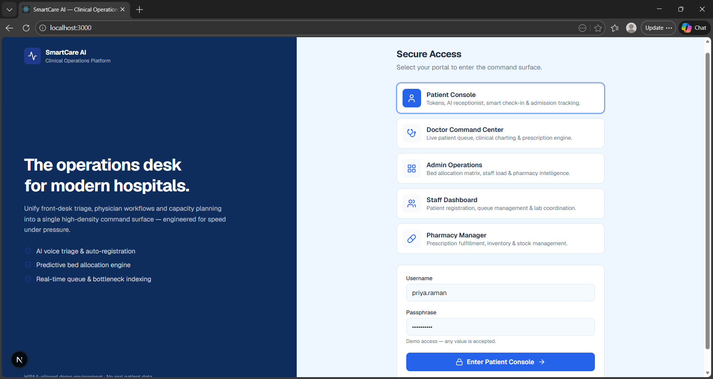
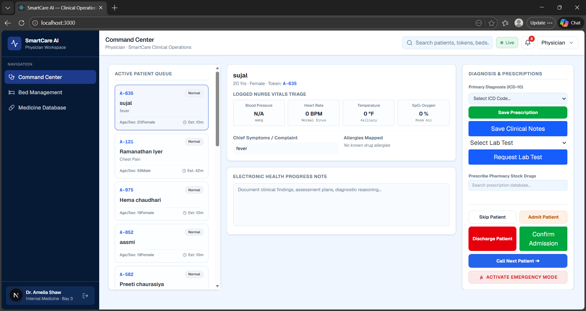
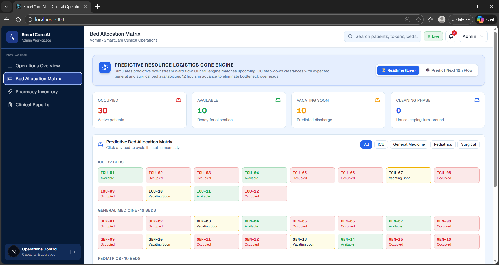
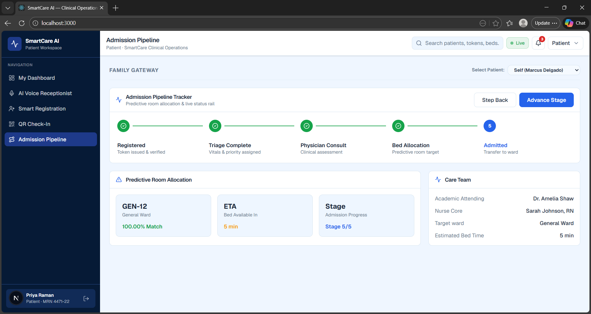

# SmartCare AI

**SmartCare AI** is a role-based hospital operations platform built with Next.js. It unifies front-desk triage, physician workflows, capacity planning, pharmacy intelligence, and lab coordination into a single real-time command surface for modern hospitals.

> HIPAA-aligned demo environment — no real patient data is used.

---

## ✨ Features

- **Multi-role access** — five dedicated portals from a single login screen:
  - 🧑‍⚕️ **Patient Console** — tokens, AI receptionist, smart check-in & admission tracking
  - 🩺 **Doctor Command Center** — live patient queue, clinical charting & prescription engine
  - 🧭 **Admin Operations** — bed allocation matrix, staff load & pharmacy intelligence
  - 👥 **Staff Dashboard** — patient registration, queue management & lab coordination
  - 💊 **Pharmacy Manager** — prescription fulfillment, inventory & stock management
- **Real-time updates** via Socket.io — live queue refresh, bed status, prescriptions, and lab requests are pushed instantly to every connected client.
- **Predictive/climate-aware pharmacy demand** — a weather-driven module (`/api/pharmacy/weather`) forecasts medicine demand based on live weather conditions for a given city.
- **PostgreSQL-backed data layer** using the `pg` driver with a shared connection pool.
- **Modern UI** built with Tailwind CSS v4, Radix/Base UI primitives, and Lucide icons.
- **Type-safe** throughout with TypeScript.

---

## 📸 Screenshots

### Login — Role Selection


### Doctor Command Center


### Admin — Predictive Bed Allocation Matrix


### Patient — Admission Pipeline Tracker


---

## 🛠 Tech Stack

| Layer            | Technology                                   |
|-------------------|-----------------------------------------------|
| Framework         | [Next.js 16](https://nextjs.org/) (App Router) |
| UI Library        | React 19                                      |
| Styling           | Tailwind CSS 4, `tw-animate-css`, `class-variance-authority` |
| Components        | `@base-ui/react`, `shadcn`, Lucide icons      |
| Real-time         | Socket.io (server + client)                   |
| Database          | PostgreSQL (via `pg`)                          |
| Language          | TypeScript                                    |
| Analytics         | Vercel Analytics (production only)             |

---

## 📁 Project Structure

```
smartcare-ai-main/
├── app/
│   ├── api/                  # API routes
│   │   ├── admin/overview
│   │   ├── doctor/           # admission, beds, lab-reports, lab-request,
│   │   │                     # medicines, notes, orders, prescription,
│   │   │                     # queue, report-upload
│   │   ├── patient/          # admission-pipeline, checkin, dashboard, register
│   │   ├── pharmacy/         # dashboard, weather
│   │   └── staff/dashboard
│   ├── lab/                  # Lab dashboard page + report upload
│   ├── layout.tsx
│   ├── page.tsx               # App entry (role login + routing)
│   └── globals.css
├── components/
│   ├── smartcare/
│   │   ├── admin/admin-dashboard.tsx
│   │   ├── doctor/doctor-command-center.tsx
│   │   ├── patient/patient-console.tsx
│   │   ├── pharmacy/pharmacy-dashboard.tsx
│   │   ├── staff/staff-dashboard.tsx
│   │   ├── modules/           # bed-matrix, lab-reports, medicine-search
│   │   ├── app-shell.tsx      # shared shell/nav for all portals
│   │   ├── login.tsx          # role-selection login screen
│   │   └── ui.tsx
│   ├── lab/
│   └── ui/
├── lib/
│   ├── db.ts                  # PostgreSQL connection pool
│   ├── socket.ts               # Socket.io client
│   ├── hospital-contex.tsx     # shared app/hospital context
│   ├── medical-data.ts         # types, seed/mock data, priority styles
│   └── utils.ts
├── public/
├── server.js                   # Custom Node server (Next.js + Socket.io)
├── next.config.mjs
├── tsconfig.json
├── package.json
└── components.json             # shadcn UI config
```

---

## 🚀 Getting Started

### Prerequisites

- **Node.js** 18.18+ (recommended: 20 LTS)
- **pnpm** (preferred) or npm
- A **PostgreSQL** database (e.g. [Neon](https://neon.tech), local Postgres, or any managed instance)
- A **weather API key** (e.g. from [OpenWeatherMap](https://openweathermap.org/api)) for the pharmacy demand-forecast feature

### 1. Clone & install dependencies

```bash
git clone <your-repo-url>
cd smartcare-ai-main

# using pnpm (recommended — repo includes pnpm-lock.yaml)
pnpm install

# or using npm
npm install
```

### 2. Configure environment variables

Create a `.env.local` file in the project root:

```env
# PostgreSQL connection string
DATABASE_URL=postgresql://<user>:<password>@<host>:<port>/<database>?sslmode=require

# Weather API key (used by /api/pharmacy/weather)
WEATHER_API_KEY=your_weather_api_key_here
```

### 3. Run the development server

The dev script boots a custom server (`server.js`) that runs Next.js alongside a Socket.io server for real-time updates:

```bash
pnpm dev
# or
npm run dev
```

The app will be available at **http://localhost:3000**.

### 4. Build for production

```bash
pnpm build
pnpm start
```

---

## 🔑 Login / Demo Access

The login screen lets you pick a role — **Patient, Doctor, Admin, Staff, or Pharmacy** — each with a pre-filled demo username. This is a demo environment: **any password is accepted**.

| Role      | Demo Username        |
|-----------|-----------------------|
| Patient   | `priya.raman`          |
| Doctor    | `dr.amelia.shaw`       |
| Admin     | `ops.controller`       |
| Staff     | `staff.registration`   |
| Pharmacy  | `pharmacy.manager`     |

---

## 📡 API Overview

| Route                                   | Purpose                                  |
|-------------------------------------------|-------------------------------------------|
| `POST/GET /api/patient/register`          | Patient registration                      |
| `POST /api/patient/checkin`               | Smart check-in                            |
| `GET /api/patient/dashboard`              | Patient dashboard data                    |
| `GET/POST /api/patient/admission-pipeline`| Admission tracking pipeline               |
| `GET /api/doctor/queue`                   | Live patient queue                        |
| `GET/POST /api/doctor/beds`               | Bed status & allocation                   |
| `POST /api/doctor/admission`              | Admit a patient                           |
| `POST /api/doctor/notes`                  | Clinical notes                            |
| `POST /api/doctor/orders`                 | Doctor orders                             |
| `POST /api/doctor/prescription`           | Create prescriptions                      |
| `GET /api/doctor/medicines`               | Medicine lookup                           |
| `POST /api/doctor/lab-request`            | Request lab tests                         |
| `GET /api/doctor/lab-reports`             | Retrieve lab reports                      |
| `POST /api/doctor/report-upload`          | Upload lab/medical reports                |
| `GET /api/admin/overview`                 | Hospital-wide operations overview         |
| `GET /api/staff/dashboard`                | Staff dashboard data                      |
| `GET /api/pharmacy/dashboard`             | Pharmacy inventory & fulfillment          |
| `GET /api/pharmacy/weather`               | Weather-based medicine demand forecast    |

---

## 🔌 Real-Time Events (Socket.io)

The custom `server.js` broadcasts the following events to all connected clients:

| Event               | Trigger                        | Broadcast              |
|---------------------|---------------------------------|--------------------------|
| `refreshQueue`       | Client requests queue refresh   | `queueUpdated`           |
| `refreshBeds`        | Client requests bed refresh     | `bedsUpdated`             |
| `prescriptionSaved`  | A prescription is saved         | `medicineUpdated`         |
| `medicineUpdated`    | Medicine/inventory changes      | `medicineUpdated`         |
| `labRequested`       | A lab test is requested         | `labRequested`            |

---

## 📜 Available Scripts

| Script          | Description                                      |
|------------------|----------------------------------------------------|
| `pnpm dev`        | Starts the custom Next.js + Socket.io dev server   |
| `pnpm build`      | Builds the app for production                     |
| `pnpm start`      | Starts the production server                       |
| `pnpm lint`       | Runs ESLint                                        |

---

## ⚠️ Disclaimer

This project is a **demonstration/prototype** of a hospital operations platform. It is **not** production-ready for handling real patient data and has not undergone a security or compliance (HIPAA/GDPR) audit. Do not use it with real PHI (Protected Health Information) without a full security review.

---

## 📄 License

No license has been specified for this project. Add a `LICENSE` file to define usage terms.